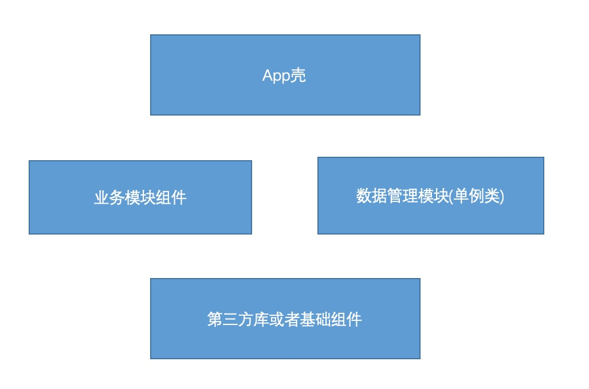
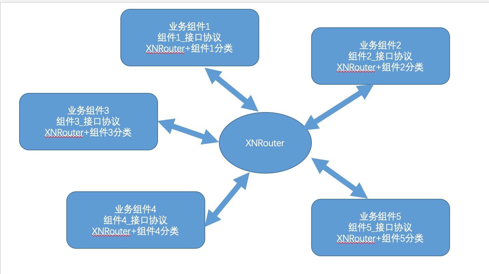
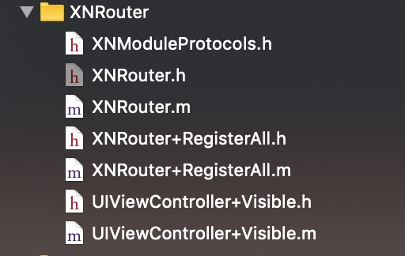

# XNRouter

###1.为什么要组件开发
当业务达到一定量级的时候，VC之间耦合非常严重，维护非常困难，可能修改一处影响到多个地方，继而产生更多的bug。假如被动修改的地方恰好又不在本次迭代范围之内，很可能该地方的修改就没有经过测试就上线了，要是产生线上bug问题就大了。

###2.组件开发App如何分层

 

###3.如何解耦

从上面设计图我们可以看出，业务组件与业务组件是互不相通的，所有的业务组件都只和路由组件XNRouter交互。具体是怎么实现的呢？

首先我们知道，业务组件之间的交互，基本上都是界面跳转，因此XNRouter主要负责创建目的ViewController.
例如这样一个情况：组件A的a界面，需要跳转到组件B的b界面。 

因为组件A和组件B是互不想通的，那只能有路由组件XNRouter负责创建b界面的VC，同时组件A要能够知道组件B提供了什么对外接口（也就是说我要跳转到b界面，应该调什么方法才能获取到b界面的VC）

因此我们在组件B中添加一个对外接口的协议， 以及XNRouter的分类用以实现对外的所有接口。
其实对外接口就是一系列创建VC的方法，例如：

	#import <Foundation/Foundation.h>
	
	#pragma mark - create_AccountVC 方法参数
	const static NSString *kParam_AccountModule_AccountVC_OrderId = @"orderId";
	const static NSString *kParam_AccountModule_AccountVC_userId = @"userId";
	
	@protocol Module_Protocol_Account <NSObject>
	
	//创建AccountVC
	- (UIViewController *)create_AccountVC:(NSDictionary *)paramDic;
	
	@end

所有创建VC的方法，都是传入字典参数，返回UIViewController。每个VC创建方法的参数字典的字段都定义在协议上面，例如上述代码中的：

	#pragma mark - create_AccountVC 方法参数
	const static NSString *kParam_AccountModule_AccountVC_OrderId = @"orderId";
	const static NSString *kParam_AccountModule_AccountVC_userId = @"userId";

然后在路由组件中实现协议中的所有方法，例如：

	#import "XNRouter+Account.h"
	#import "XNLAccountVC.h"
	
	@implementation XNRouter (Account)
	
	- (UIViewController *)create_AccountVC:(NSDictionary *)paramDic {
	    
	    //1. 取参数，并校验参数
	    NSString *orderId = paramDic[kParam_AccountModule_AccountVC_OrderId];
	    NSString *userId = paramDic[kParam_AccountModule_AccountVC_userId];
	    
	    //2. 创建VM->VC
	    XNLAccountVM *accountVM = [[XNLAccountVM alloc] init];
	    XNLAccountVC *accountVC = [[XNLAccountVC alloc] initWithVM:accountVM];
	    return accountVC;
	    
	}
	
	@end

###其实，组件开发并不难，其本质是规范。定义良好的规范，严格遵循规范来，事情就变得非常简单。

#####接下来，我们再来看看XNRouter路由组件是怎么实现的，首先我们看一下具有有哪些东西：

非常简单，就4部分，第一个是XNModuleProtocols.h 文件， 其实就是把各个业务组件的协议文件挪到这里而已。 

第二个就是XNRouter类， 这是一个单例类， 这个类的几个方法主要是用于处理url跳转。
第三个就是XNRouter+RegisterAll的分类， 所有url path注册都放在这个分类里， 然后在app启动的时候，调用一下即可。
第四个UIViewController+Visible类， 用于获取App当前界面的VC。

##如何使用XNRouter进行界面跳转？
上面讲了这么多，那到底该怎么用呢？，例如我们要获取Home组件的Home界面的VC，请看代码：
	
	//首先拿到路由组件单例
	XNRouter *router = [XNRouter sharedInstance];
	
	//方法1：将router转为遵循home组件协议的对象，然后调用create_homeVC方法创建视图控制器。
	XNLBaseViewController *homeVC = 
	[(id<Module_Protocol_Home>)route create_homeVC:nil];
	
	//方法2：通过url创建，前提是路由组件有对path("aaaa/home")注册过。
	XNLBaseViewController *homeVC = [router viewControllerForURL:@"huicui://aaaa/home?a=10&b=20&c=30"];
    

	//然后是Push，还是present，那看你自己咯。
	[self.navigationController pushViewController: homeVC animated:YES];
	

##具体开发流程：
1. 集成XNRouter

2. 新建一个业务组件，然后开发实现。 

3. 以及定义该组件的对外接口协议，以及XNRouter的分类，进行接口实现。

4. 组件开发完成后，把协议文件剪切到XNRouter组件下，并添加到XNModuleProtocols文件中。这样，其他组件即可进行调用联调了。  当然在组件开发前期就可以把协议接口定义好，放到XNRouter组件下，其他组件开发者就可以提前开发与本组件交互的相关逻辑。
